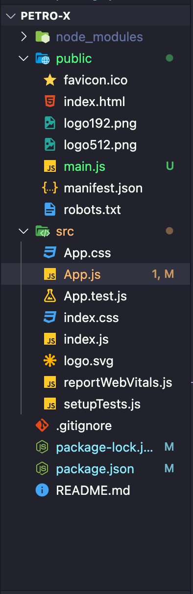

## 1. Download & Install latest version of node with default settings. [Node-Download](https://nodejs.org/en/download)
    - Check node is installed correctly or not : type in system cmd -> node --version
    - npm ( node package manager ) it is automatically downloaded with node this will help in downloading and managing packages.
    - Check npm version : type in system cmd -> npm --version

## 2. Creating React app
- Basic commands to create app
    a. npx create-react-app my-app -> it will create folder `my-app` where all front-end code exist. (if create react app   not a command) then install -> npm install -g create-react-app : this will install it globally (for first time only)
    b. cd my-app
    c. npm start -> to start the development server only for development. ( In production build file that do not need any server to start fornt-end )
    d. opt. vs code extension : [Source](https://www.syncfusion.com/blogs/post/7-vs-code-extensions-for-react-developers.aspx)

## 3. Folder Structure
    
    #Explaination
        - node_modules : all the packages we downloads through npm is stored locally here let it be there.
        - public : title, metadata, fab-icon and root element is stored here. That we get in `index.js` and render here App.js   robots.txt is just for google crawling for seo let it be.
        - src : This is main folder > we have to work on we cannot access any file or media outside this folder
            #Files
            - index.js : main file that runs after npm start command
                # Browser DOM have element with id root that we access with `index.js` and render `App.js` there.
            - index.css and app.css : styling file
            - reportWebVital.js : it report performance metrics of application, let it be.
            - setupTest.js : To run tests on app, let it be.
            - package.json : that manage package and scripts etc.
            - package-lock.json : history of package.json, let it be.

## 4. Cleaning Dummy Content
    1. In `public/index.html` : update fab-icon logos, title and remove unnecessary comments.
    2. In `src/index.css` and `src/app.css` remove styling.
    3. In `src/App.js` remove dummy jsx and add jsx (html + js) that is visible on the screen;

## 5. Splitting UI into components
    step 1 : Make `Components` directory under `src` directory.
    step 2 : Make Components -> Header, Form and Footer Components (function or class based components).
        - creating functional components
            `Header.js`
                <pre>
                ```
                import react form 'React'
                
                ```
                </pre>


